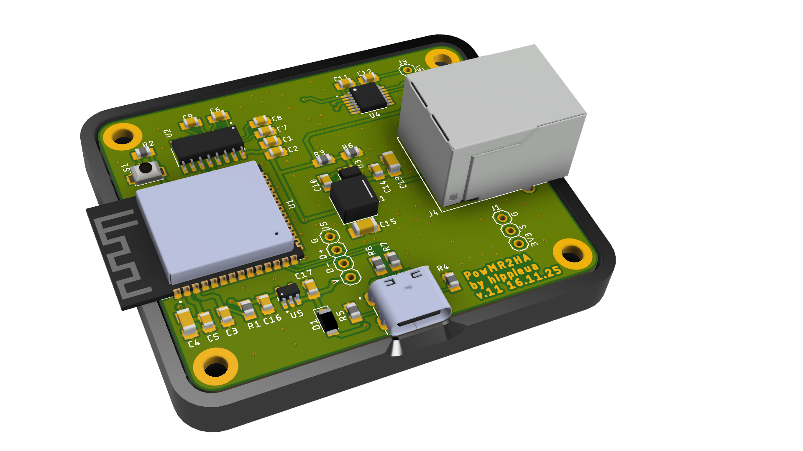
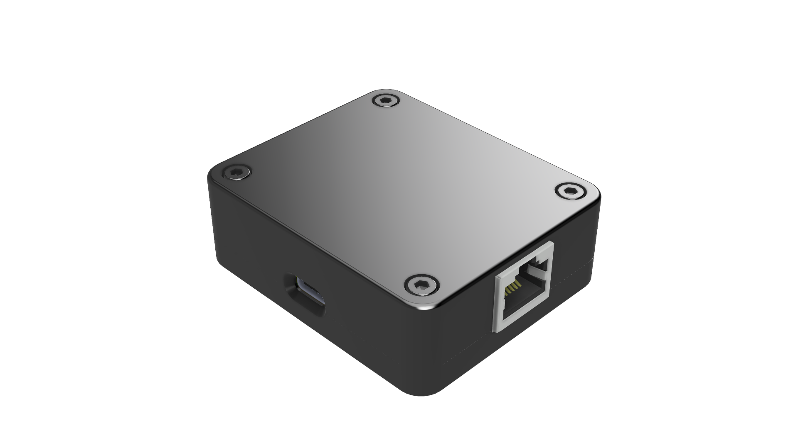

# Pro PCB

All-in-one professional PCB solution for PowMr Hybrid Inverter monitoring.

## Description

Pro PCB is a fully integrated solution that combines ESP32-S3, RS232 interface, power management, and sensor interfaces on a single compact board.

This version is ideal for users who want a clean, professional installation with minimal wiring and maximum reliability.

## Key Features

- **ESP32-S3-WROOM** - Modern dual-core controller
- **Integrated MAX232** - Built-in RS232 level converter for inverter communication
- **USB-C Interface** - Native USB support for programming and debugging (no external USB-Serial adapter needed)
- **Onboard DC-DC Converter** - LMR51430 5V power supply (input: 12V from inverter)
- **Logic Level Shifter** - TXB0108 for safe PZEM module connection
- **AC Current Sensor** - Built-in AC current monitoring capability
- **RJ45 Connector** - Standard connector for inverter RS232 connection
- **Compact Design** - All-in-one solution, no external modules required

## Components

### Main ICs
- **U1**: ESP32-S3-WROOM-1 (Main controller)
- **U2**: MAX3232 (RS232 transceiver)
- **U3**: LMR51430 (DC-DC converter)
- **U4**: TXB0108PWR24 (8-bit bidirectional level shifter)

### Connectors
- **USB-C**: Programming, debugging, and power
- **RJ45**: RS232 connection to inverter
- **PINHD-1x4**: PZEM module connection (3.3V logic level)
- **PINHD-1x3**: AC sensor connection
- **USB_PIN (PINHD-1x4)**: Additional USB data pins

### Power Supply
- **Input**: 12V DC (from inverter auxiliary power)
- **Output**: 5V (via LMR51430)
- **Output**: 3V3 (via TPS70933DBVR)

### Optional modules
- **PZEM-004T**
- **AC 220V Optocoupler Isolation Module**

## Pinout and Connections

### Inverter Connection (RJ45)

The PCB uses a standard RJ45 connector for connection to the inverter's RS232 port:

| RJ45 Pin | Color (T568B) | Description |
|----------|---------------|-------------|
| 1        | Orange/White  | RS232_RX    |
| 2        | Orange        | RS232_TX    |
| 3        | Green/White   | NC          |
| 4        | Blue          | +12V        |
| 5        | Blue/White    | NC          |
| 6        | Green         | NC          |
| 7        | Brown/White   | NC          |
| 8        | Brown         | GND         |

*Note: Verify the exact pinout with your inverter model. Some models may have different pin assignments.*

### PZEM Module Connection (PINHD-1x4)

Connect PZEM-004T:

| PCB Pin  | PZEM Pin | Description                      |
|----------|----------|----------------------------------|
| 5V       | 5V       | 5V power supply for PZEM Logic   |
| TX       | TX       | PZEM TX → ESP RX (level shifted) |
| RX       | RX       | PZEM RX ← ESP TX (level shifted) |
| GND      | GND      | Ground                           |

**Important**: The TXB0108 level shifter ensures safe 5V ↔ 3.3V conversion for PZEM communication.

### AC Sensor Connection (PINHD-1x3)

Built-in AC current sensor interface:

| PCB Pin | Sensor | Description      |
|---------|--------|------------------|
| 3V3     | VCC    | 3.3V power       |
| S       | OUT    | AC current sense |
| G       | GND    | Ground           |

### USB-C Connection

The USB-C port provides:
- **Power**: Can power the board directly (5V)
- **Programming**: Native USB for flashing firmware
- **Debugging**: USB serial for logs and debugging

No external USB-to-Serial adapter required!

### Power Input Options

The board supports two power input methods:

1. **From Inverter** (recommended): Connect 12V from inverter auxiliary power to the RJ45 connector
2. **USB-C**: Power via USB-C port (5V) for development and testing

## First Time Setup

1. **Power the board** via USB-C
2. **Flash ESPHome** firmware using ESP Web Flasher or esptool
3. **Connect to inverter** via RJ45 cable
4. **Configure WiFi** and add to Home Assistant
5. **Optional**: Connect PZEM module for AC grid monitoring

## Bill of Materials (BOM)

Complete list of components required for assembly:

- [BOM Invertor2HA v17.csv](BOM%20Invertor2HA%20v17.csv) - Component list (CSV format)
- [BOM Invertor2HA v17.xlsx](BOM%20Invertor2HA%20v17.xlsx) - Component list (Excel format)

See also [Invertor2HA v17.pdf](Invertor2HA%20v17.pdf) for complete schematic and component placement.

## Photos

<table>
<tr>
<td valign="top">

 <i>3D render</i>
</td>
<td valign="top">

 <i>Assembly diagram</i>
</td>
</tr>
</table>

## 3D Printable Case

The project includes a custom-designed 3D printable case for the PCB:

- [Top part](case/top.stl) - Upper case cover
- [Bottom part](case/bottom.stl) - Lower case base with PCB mounting

### Printing Recommendations

- **Material**: PLA, PETG, or ABS
- **Layer height**: 0.2mm recommended
- **Infill**: 15%

## Resources

- [Schematics (PDF)](Invertor2HA%20v17.pdf) - Complete schematic diagram with all components
- [Gerber Files](gerber_v23_2025-12-02.zip) - PCB manufacturing files (ready for production)
- [3D Case Files](case/) - STL files for 3D printing

## License

This work is licensed under the same license as the main project.

## Credits

Designed by [@hippieua](https://github.com/hippieua)
